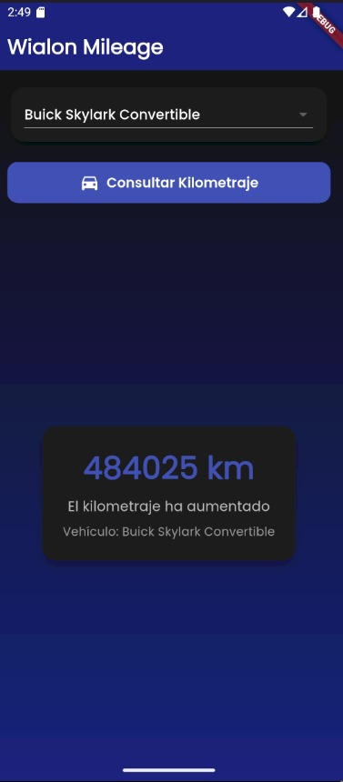
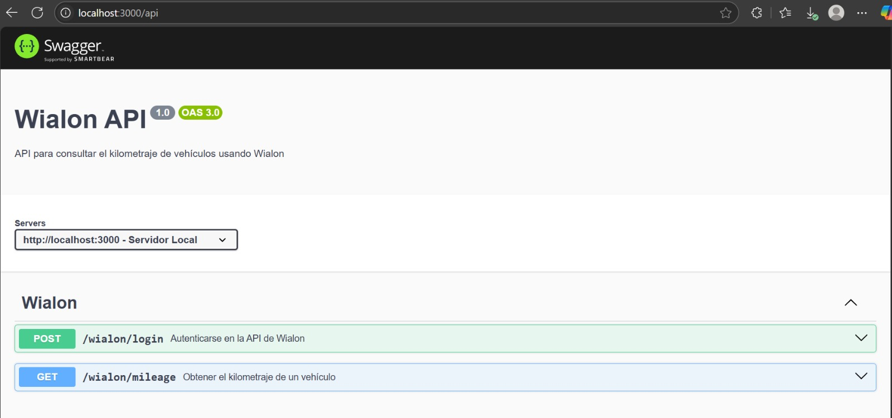

# Wialon Mileage

  


## Descripción

**Wialon Mileage**, aplicación práctica con la que puedes consultar el kilometraje de vehículos (como el "Buick Skylark Convertible", y otros que oficialmente aparecen en la consulta oficial de la API de Wialon, se pueden seleccionar con el dropdown menu). El backend está desarrollado en **NestJS**, autentica con la API de Wialon y expone endpoints para obtener el kilometraje. El frontend, construido con **Flutter**, es una interfaz responsiva para iOS/Android, con un diseño oscuro, animaciones fluidas y manejo de estados con `provider`.

Se consideró el uso del token sin expiración, para generar eid, y por medio de éste elemento se hacen las consultas de kilometraje. Se pueden ver los endpoints en swagger mediante la ruta http://localhost:3000/api.

Acorde a documentación, 
- loggueo: POST ```https://hst-api.wialon.com/wialon/ajax.html?svc=token/login&params={"token": TOKEN}``` 
- consulta de kilometraje, mediante flag 8193 (para obtener valor del campo "cnm"). Ejemplo de ruta según documentación: POST ``` https://hst-api.wialon.com/wialon/ajax.html?svc=core/search_items&params={"spec":{"itemsType":"avl_unit","propName":"sys_name","propValueMask":"Buick Skylark Convertible","sortType":"sys_name"},"force":1,"flags":8193,"from":0,"to":0}&sid=EID_OBTENIDO_TRAS_LOGGUEO``` 
(Nota: propValueMask puede tener el valor de cualquier vehículo acotado en la API). En la aplicación, puedes elegir entre varios vehículos

## Capturas de Pantalla

### Interfaz de la App


### Documentación Swagger


### Postman, consulta de kilometraje en ruta oficial

### Características Principales
- **Backend (NestJS)**:
  - Autenticación con la API de Wialon mediante token (`POST /wialon/login`).
  - Consulta del kilometraje de un vehículo (`GET /wialon/mileage?vehicleName=...` en vehicleName puedes poner "Buick Skylark Convertible". Ejemplo: http://localhost:3000/wialon/mileage?vehicleName=Buick%20Skylark%20Convertible en postman, petición GET).
  - Documentación interactiva de la API en Swagger (`http://localhost:3000/api`).
  - Soporte CORS para permitir solicitudes desde el frontend.
    
- **Frontend (Flutter)**:
  - Interfaz con tema oscuro, gradientes y tipografía Poppins.
  - Dropdown para seleccionar el vehículo ("Buick Skylark Convertible", y otros reales comprobados con la API).
  - Botón para consultar el kilometraje con animaciones usando `animate_do`.
  - Indicador de carga y manejo de errores.
  - Comparación del kilometraje actual con el anterior para mostrar mensajes como "Kilometraje inicial", "El kilometraje ha aumentado" o "El kilometraje se mantuvo constante".
- **Arquitectura limpia**: Separación de preocupaciones con modelos, proveedores y servicios.

## Tecnologías Utilizadas

### Backend
- **NestJS**: Framework de Node.js para aplicaciones escalables.
- **TypeScript**: Código tipado y mantenible.
- **Axios**: Para solicitudes HTTP a la API de Wialon.
- **@nestjs/config**: Gestión de variables de entorno.
- **Node.js**: v16 o superior.

### Frontend
- **Flutter**: Framework de Dart para aplicaciones móviles multiplataforma, versión 3.29.2
- **http**: Para solicitudes HTTP al backend.
- **provider**: Gestión de estado.
- **google_fonts**: Tipografía Poppins para un diseño moderno.
- **animate_do**: Animaciones fluidas en la UI.

## Requisitos Previos

- **Node.js**: v16 o superior (`node --version` para verificar).
- **NestJS CLI**: Instalable globalmente con `npm install -g @nestjs/cli`.
- **Flutter SDK**: v3.29.2 con Dart 3.24.x (verifica con `flutter --version`).
- **Git**: Para control de versiones (`git --version` para verificar).
- **Emulador o dispositivo físico**: Android Studio con emulador Android o Xcode para iOS.
- **Token de Wialon**: Necesario para el archivo `.env`.

## Detalles e instalación

La estructura es: 

``` 
ITire/
├── backend/
│   ├── src/
│   │   ├── wialon/
│   │   │   ├── wialon.service.ts
│   │   │   ├── wialon.controller.ts
│   │   │   ├── wialon.module.ts
│   │   │   └── dto/mileage.dto.ts
│   │   └── app.module.ts
│   ├── .env
│   ├── main.ts
│   ├── package.json
│   └── ...
├── client/
│   ├── lib/
│   │   ├── models/
│   │   │   └── mileage_state.dart
│   │   ├── providers/
│   │   │   └── mileage_provider.dart
│   │   ├── screens/
│   │   │   └── mileage_screen.dart
│   │   └── main.dart
│   ├── pubspec.yaml
│   └── ...
├── README.md
└── .gitignore
```

- Inicia el backend con npm run start:dev
- El servidor corre en http://localhost:3000
- Se puede explorar la documentación de la API en Swagger: Para ello, abrir http://localhost:3000/api para ver los endpoints /wialon/login (POST) y /wialon/mileage (GET), con ejemplos, parámetros, y respuestas
- Para front, flutter run

## Cómo interactúa la app

Selecciona "Buick Skylark Convertible" en el dropdown, u otro.
Presiona "Consultar Kilometraje".
Verifica que muestre el kilometraje (por ejemplo, 483883 km), un mensaje de estado, y el nombre del vehículo.
